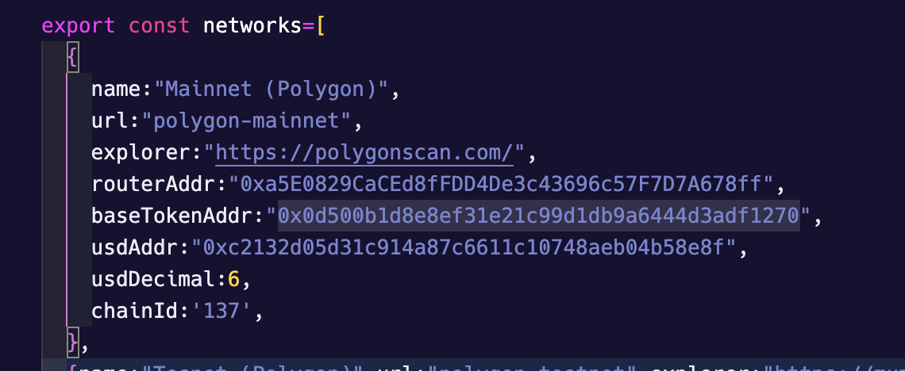
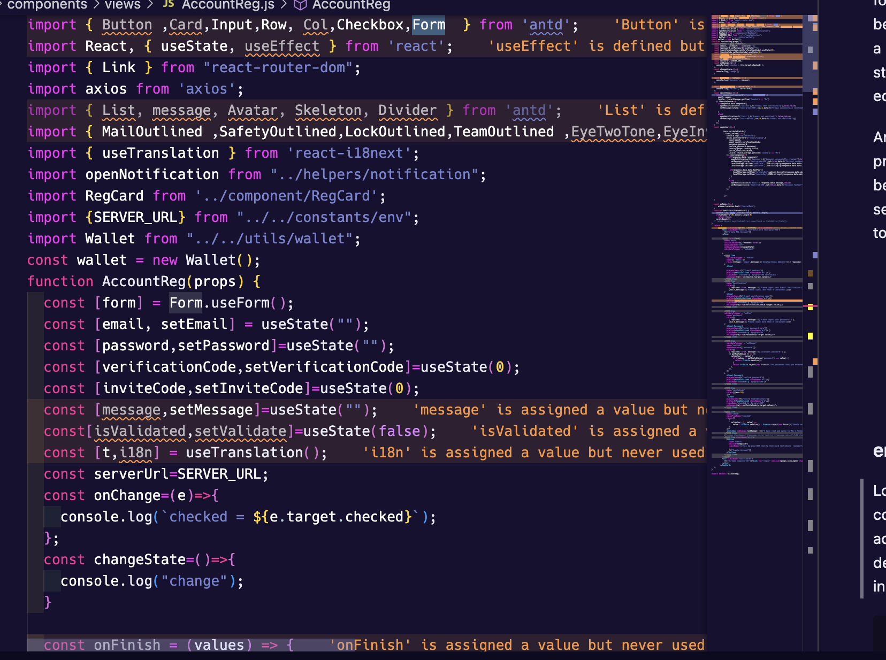
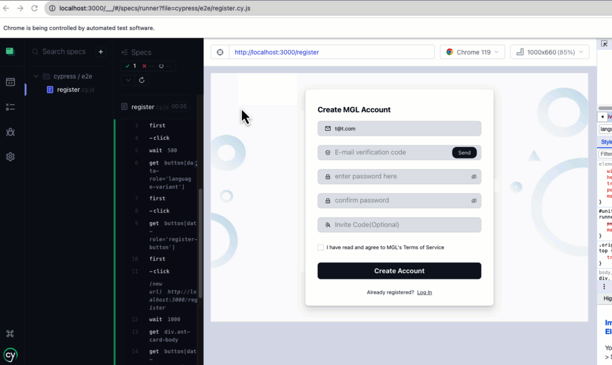
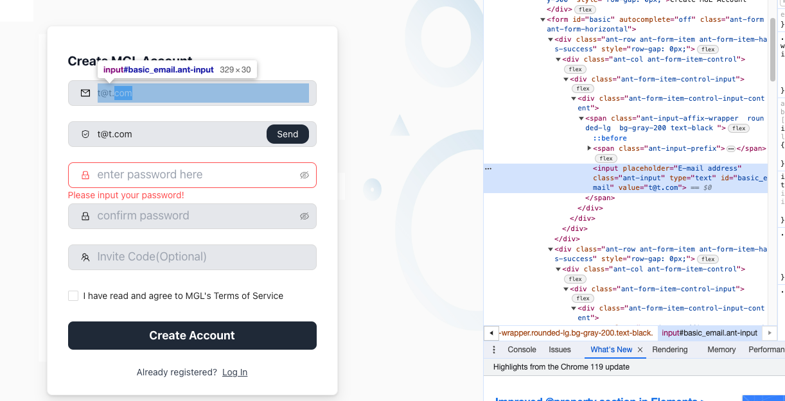
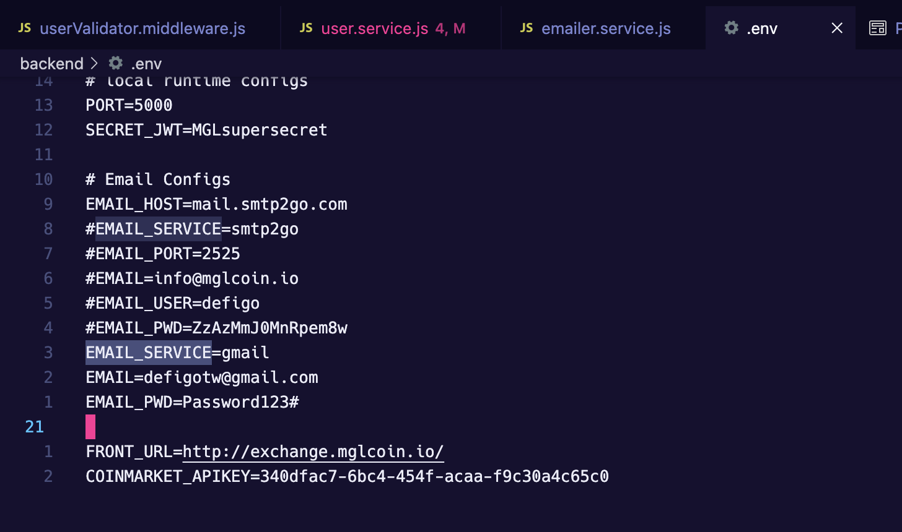
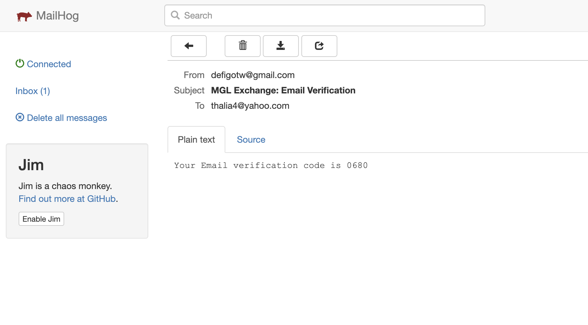
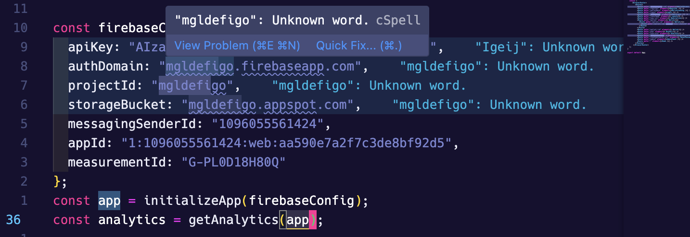
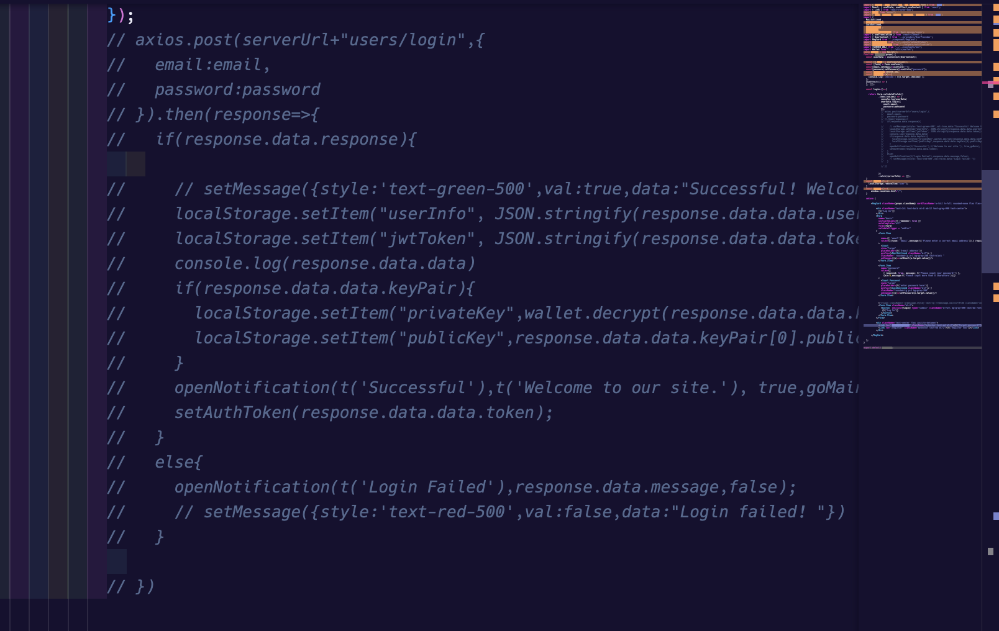

# Skill test

## Issue description

Issue. User can not register in account. And can not login to profile page.

## Expected behavior

User is able to register, login and get access to his profile page

## Found bugs

### package.json

```bash
"server": "cd backend & npm start", -> 
"server": "cd backend && npm start"
```

---

### error:0308010C:digital envelope routines::unsupported

*Command*: yarn start

*Error*: `error:0308010C:digital envelope routines::unsupported`

*Reason*: node v20.9.0

*Solution*: add information about required version of node (~16) to readme/maintain solution and upgrade node version and all related packages to last stable version of node, if it's possible

```nvm use v16.13.0```

---

### project contains separate project for backend with packages.json not in root

So I think it is reasonable to add separate script to package json for first initialization

```bash
"init-project": "yarn install && cd backend && yarn install"
```

So you can get working solution right from root folder, without cd/install routines

---

### style-guide problems and no formatter

I've noticed that there are no any style-guid/configured formatter is in project. So, it is preferable to have one (example - eslint/formatter or their combination)

For example, such type of formatting with no space between work and semicolon is less readable then this:

```js
    usdAddr:"0xc2132d05d31c914a87c6611c10748aeb04b58e8f",
```

```js
    usdAddr: "0xc2132d05d31c914a87c6611c10748aeb04b58e8f",
```

And there are few of well-known style sets, such as airbnb preset which are ready-to-use with eslint and formatter, so it is necessary to follow formatting rules. I'm not going to setup this, because it's time-consumption task and will result a lot of formatting changes in whole project :) let's stick to the plan, but thats why some of files edited by me could be re-formatted.

And, uncontroller reformatting is bad because produces changes and garbage in code base, because everyone has different ide and different settings. I could right an essay for how important to follow formatting later :)



### env.js - wrong SERVER_URL

Looks like there are 2 different urls for api consumption, and real-life api should be addressed only in production mode, local development - during development. So, api switch in case of env was added:

```js

const isDev = process.env.NODE_ENV === "development"

export const SERVER_URL = isDev ? "http://127.0.0.1:5000/api/ " : "https://mglcoin.io/api/" 

```

Mode elegant way - to create new .env.development and .env.production and split this variable across different envs

## db connection

- Added `DB_HOST` in .env
- `restore-database.sh` added

## sendEmail function on user sign up moved to emailerservice

Now, all email send functions use the same email transport in emailer service:

```js
    static transport() {
        const transportOptions = {
            service: !isDev ? process.env.EMAIL_SERVICE : undefined,
            host: !isDev ? process.env.EMAIL_HOST : undefined,
            port: Number(process.env.EMAIL_PORT),
            //port: Number(process.env.EMAIL_PORT),
            auth: isDev ? {} : {
                //user: process.env.EMAIL_USER,
                user: process.env.EMAIL,
                pass: process.env.EMAIL_PWD
            }
        }

        const transport = nodemailer.createTransport(transportOptions);

        return transport
    }
```

## dev script in package.json for backend changed for passing node_env

```js
    "dev": "NODE_ENV=development nodemon"
```

## dev script in package.json for frontend changed to run backend in dev mode

This change allowed to run backend with hotreload

```js
    "server:dev": "cd backend && npm run dev",
    "dev": "concurrently \"npm run server:dev\" \"npm run client\"",
```

## absent field added for user model get_bnb

```sql
CREATE TABLE `user` (
  `id` int(10) NOT NULL,
  `email` varchar(50) NOT NULL,
  `password` varchar(100) NOT NULL,
  `country` varchar(30) NOT NULL,
  `invite_code` int(11) NOT NULL,
  `role` varchar(10) NOT NULL,
  `get_bnb` bit NOT NULL
) ENGINE=InnoDB DEFAULT CHARSET=utf8mb4;
```

## Possible improvements

### Lots of unused imports and variables among project files




I think there should be strict rule for formatter to prevent commit code with unnecessary imports because they poison program code and could produce bundle size increase. Those rules are configured through eslint/prettier and git hooks such as huscky

### Use typescript

It is necessary to prevent a lot of bugs and support strict typing. And it is better to embed typescript in project while there is no huge codebase, in the beginning. Advantages ot typescript are HUGE.

### Write tests

Unit tests and integrations tests are important to maintain application stability and save nervous of developers and customers. Also - to preserve hand regression testing each time. Better to configure ci/cd process with automatic test running.

I've set up cypress for integration test and covered a few business-procedures:



### Bad/absent names for input fields on register form



On each input field should be added valuable name such as email, address, phone etc... This helps browsers to provide autofill and for developers - to receive better-labelled data on form submit

### Email service




In .env file there is a gmail provider. For testing purposes, better to redirect all email to local testing services, such as mailhog - https://github.com/mailhog/MailHog. So, it's handy to run it in docker, make another .env.development file and define url to this testing smtp server to mailhog, and receive it on localhost in browser.



### Store secrets in another way



My approach - in ci/cd secrets sections (for example, github actions has user secrets for repository, where value can be stored safely)


### Fix console warnings

Of different types, for example:


### Remove comments and unused code

